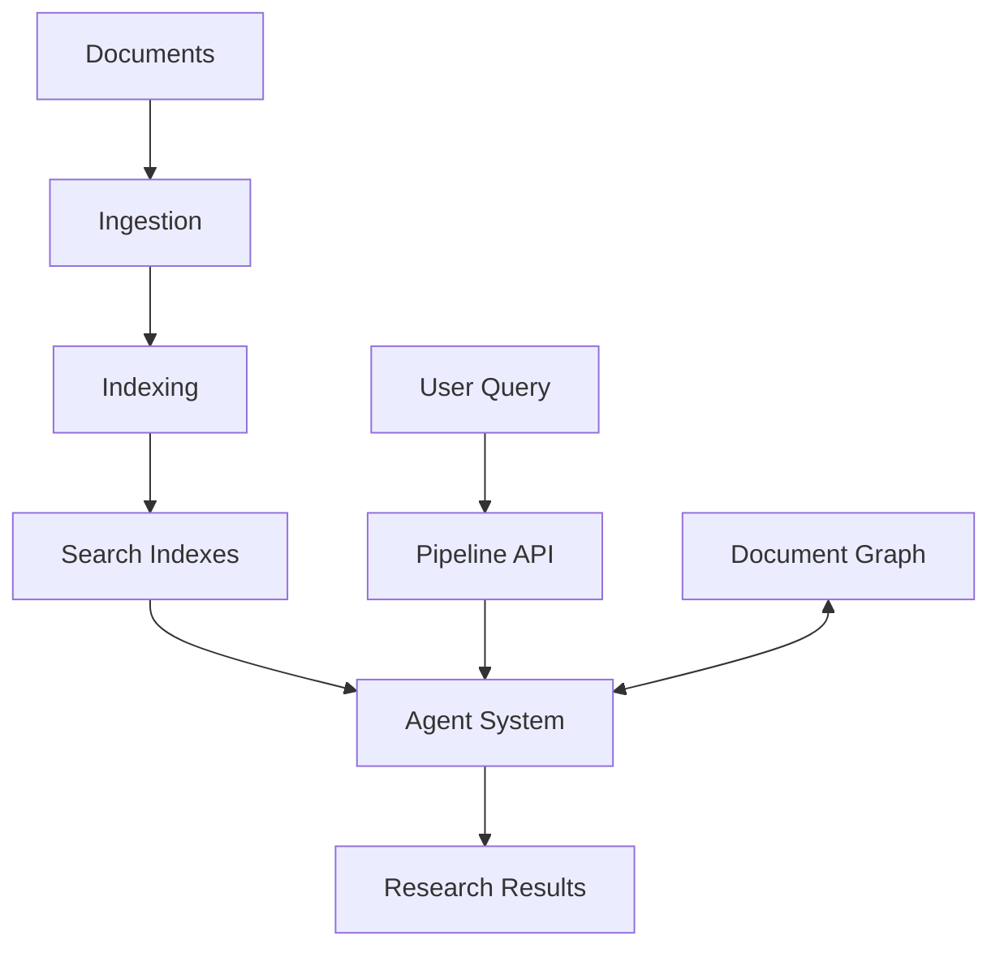

# beyondRAG
BeyondRAG is a local, agent-powered framework for deep document understanding. It replaces shallow top-k retrieval with dynamic slicing, memory tracking, multi-step reasoning, and traceable answers. Ideal for offline corpora, private research, and autonomous document exploration.


Dynamic-slicing, multi-step, memory-aware local-document research served through **Open WebUI Pipelines**.

## Overview

BeyondRAG is a sophisticated document research system that enables intelligent exploration of local document collections. It combines vector search, BM25 text search, and LLM-powered agents to provide comprehensive research capabilities.

### Key Features

- **Multi-modal Document Processing**: Support for PDF, DOCX, and TXT files
- **Intelligent Chunking**: Semantic or recursive chunking strategies
- **Advanced Search**: BM25, vector, and hybrid search capabilities
- **Graph-based Navigation**: Navigate between related documents and pages
- **Memory-aware Research**: Tracks snippets, reflections, and query evolution
- **LLM-powered Agents**: Code and reasoning agent implementations
- **Open WebUI Integration**: Served through Open WebUI Pipelines

## Architecture



## Quick Start

```bash
# 1 ─ Install dependencies
pip install -r pipelines/requirements.txt

# 2 ─ Index your docs
python -m indexing.builder

# 3 ─ Launch the pipeline server
docker-compose up --build -d
```

## Configuration

Configuration is managed through `configs/pipeline.yaml`. Key settings include:

- **LLM**: Model selection and connection details
- **Agent**: Agent mode and system prompt
- **Reformulation**: Query reformulation settings
- **Memory**: Snippet tracking and reflection settings
- **Chunking**: Document chunking strategies
- **Slicing**: Text slicing parameters

## Components

### Document Processing

- **Ingestion**: Loads documents from the `docs` directory
- **Indexing**: Creates BM25 and vector indexes
- **Graph**: Builds a navigable graph of document relationships

### Search & Retrieval

- **BM25 Search**: Keyword-based search using Whoosh
- **Vector Search**: Semantic search using FAISS
- **Hybrid Search**: Combined approach with weighted results

### Agent System

- **Code Agent**: Tool-based agent using smolagents
- **Reasoning Agent**: Graph-based agent using langgraph
- **Memory**: Tracks snippets, reflections, and queries

### Pipeline Integration

- **Open WebUI**: Conforms to Open WebUI Pipelines interface
- **Standalone**: Can run as a standalone server

## Development

### Project Structure

- `backend/`: Core backend components
  - `agents/`: Agent implementations
  - `tools/`: Search and navigation tools
  - `config.py`: Configuration management
- `indexing/`: Document indexing components
- `ingestion/`: Document loading and watching
- `pipelines/`: Open WebUI Pipeline integration
- `configs/`: Configuration files
- `docs/`: Document storage

### Running Standalone

```bash
python -m pipelines.deepresearch_pipeline --port 9123
```

## License

[MIT License](LICENSE)
=======

